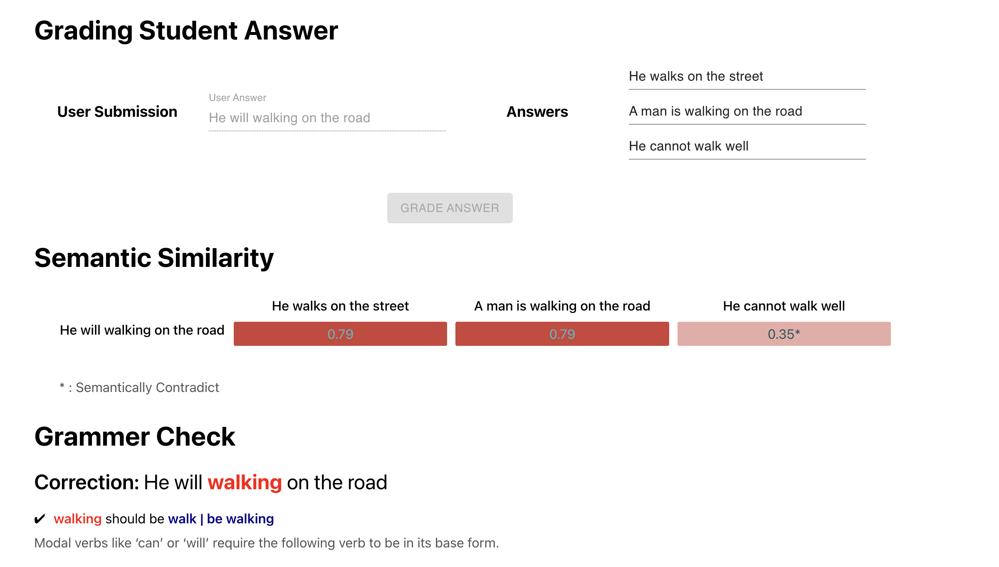
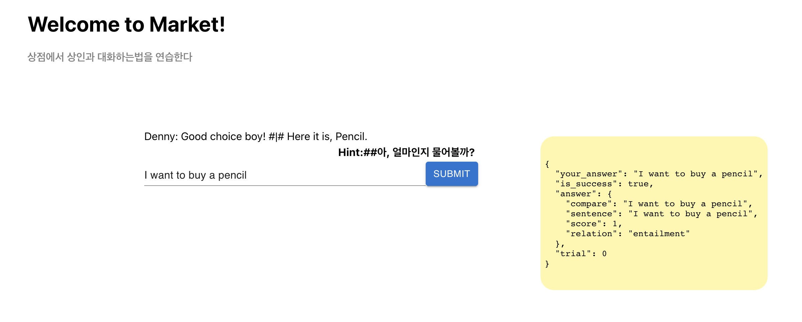

# 시나리오 매칭(Multitask Text Similarity)
*March 28th, 2022*
<br>
<br>
유저들이 메타버스내의 NPC와 영어로 의도된 시나리오에 맞게 대화할 수 있게 대화내용을 분석하는 프로그램입니다.

**설명 영상:** https://youtu.be/RFWfzFXgiuU

## 기능 
* 유저의 답변을 정답과 비교해 의미론적 유사도를 알려줍니다.
* 문장이 대립되는지 여부와 문법적 오류 및 개선사항도 함께 알려줍니다.
* 

<br>
<br>

* NPC와 데모 대화를 나누어 볼 수 있습니다.
* NPC는 유저의 발화가 정답인지 여부에 따라 정답을 유도하는 대화를 진행합니다.


<br>
<br>

## 구현
### Semantic Text Similarity 비교
- 데이터셋
  - NLI 태스크 데이터 [SNLI](https://nlp.stanford.edu/projects/snli/), [MNLI](https://cims.nyu.edu/~sbowman/multinli/)와 STS 태스크 데이터 [SemEval](https://semeval.github.io/), [sts-b](https://paperswithcode.com/dataset/sts-benchmark)를 multitask training 에 사용

- 모델
  - [Distil-Bert](https://huggingface.co/docs/transformers/model_doc/distilbert) 사용
- 학습 방법
  - sts loss: cosine similarity, nli loss: cross entropy 의 합으로 multitask-learning 진행


## 실행

### 배포
```
python deploy.py
```
<br>
